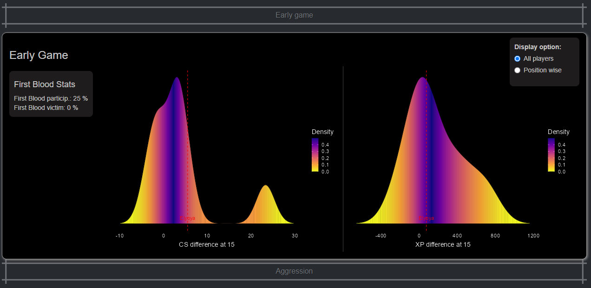

# ProLeagueVizz

 <!-- If you have a logo or relevant image, include it here -->

An interactive Shiny app for analyzing professional League of Legends data. The app is a work in progress and currently offers insights into player statistics for a subset of LEC players.

# Table of Contents

- [Introduction](#introduction) 🌟
- [Features](#features) ⚙️
  - [Player Statistics](#player-statistics)
  - [Team Statistics](#team-statistics)
  - [Team Comparison](#team-comparison)
- [Technical Overview](#technical-overview) (Where the Magic Happens ✨🧠)
  - [Data Scraping and Gathering](#data-scraping-and-gathering)
  - [Data Processing and Analysis](#data-processing-and-analysis)
  - [Graphs and Content-Based Recommender System](#graphs-and-content-based-recommender-system)
  - [Scaling and Future Enhancements](#scaling-and-future-enhancements)
- [Getting Started](#getting-started) 🛠️
  - [Prerequisites](#prerequisites)
  - [Installation](#installation)
- [Usage](#usage) 📝
- [Roadmap](#roadmap) 🗺️
- [Contributing](#contributing) 🤝
- [Acknowledgements](#acknowledgements)🙏

## Introduction

Welcome to ProLeagueVizz, an interactive Shiny app designed to provide insights into professional League of Legends data. The app is dedicated to analyzing player statistics and aims to expand its features to cover team statistics and team comparisons in the future.

### Inspiration

The world of professional League of Legends is a rapidly evolving and growing field. While it may not yet have reached the global scale of traditional competitive sports like football or basketball, it's undeniably gaining momentum and attracting an ever-increasing fan base. With this growth comes a wealth of data that is being generated by every match, every player, and every team. This data is a goldmine of information that has the potential to illuminate the intricacies of the game, the strategies employed by teams, and the exceptional skills of players.

### The Importance of Data Analysis

However, despite the availability of this data online, it often presents a challenge to interpret and harness effectively. In the midst of this data explosion, we find ourselves faced with a critical need: the ability to compare players and teams, assess a player's performance based on specific statistics, and gain deeper insights into the game itself. Moreover, in this relatively new and evolving field, many of the metrics we encounter are ripe for exploration and innovation, offering the potential for groundbreaking discoveries.

### Bridging the Gap with ProLeagueVizz

The goal of ProLeagueVizz is to bridge this gap between raw data and meaningful insights. We've created this app to present the existing data in a visual, intuitive manner that simplifies comparisons, facilitates player and team analysis, and helps users gain a deeper understanding of the game. As we move forward, our vision extends beyond visualization; we're excited to explore and introduce advanced metrics that can unlock new dimensions of analysis and offer fresh perspectives on players, teams, and the game of League of Legends itself.



In a rapidly evolving field where the potential for insights is vast and uncharted, ProLeagueVizz strives to be a valuable resource for both casual fans and serious analysts. We invite you to join us on this journey of discovery as we uncover the hidden stories within the data and contribute to the evolving narrative of professional League of Legends.

## Features

### Player Statistics

In the **Player Statistics** section of ProLeagueVizz, you'll find a comprehensive collection of the most important statistics regarding a player's performance. The section allows you to navigate seamlessly between different tournaments from various years in which the player participated. Notably, you can gain insights into how the player's performance compares to others within the same event or tournament.

#### Basic Player Details

The section begins by presenting key player information, including their name, team, trajectory, and tournament results. This provides a solid foundation for understanding the player's context within the League of Legends competitive landscape.

#### Early Game Performance

Delve into the player's early game performance metrics. This includes crucial details such as their first blood statistics (both given and received), CS (Creep Score) difference, and more. The early game insights can be viewed in comparison to all players of the tournament or exclusively within the player's specific role or position.

#### Aggression Analysis

The **Aggression** subsection offers a deeper understanding of the player's aggression level. This aspect is pivotal in comprehending how much the player contributes to their team's damage, kills, assists, and overall impact. Furthermore, the analysis provides the player's KDA (Kill/Death/Assist ratio) and solo kills, offering valuable insights into their gameplay style. As with previous sections, these metrics can be examined in the context of all tournament players or exclusively within the player's role.

#### Efficiency Evaluation

Efficiency is a critical aspect of a player's performance. The **Efficiency** section provides key information on whether the player is able to achieve high performance while efficiently using resources. A player who can excel with minimal resources showcases adaptability and skill. This metric goes beyond the traditional performance indicators and provides a more holistic view of a player's capabilities.

#### Champion Pool and Playstyle Analysis

The **Champion Pool** subsection is dedicated to exploring the champions a player is proficient in. It offers insights into each champion's KDA, win rate, and more. The section also features a unique similarity graph, visually representing the relationship between the champions the player has used. This graph aids in identifying the player's playstyle, revealing patterns and potential preferences. The similarity graph is built on a content-based recommender system, and our goal is to continually enhance and refine this feature to provide even more accurate insights.


The Player Statistics section of ProLeagueVizz empowers you to uncover hidden patterns, gain valuable insights, and better understand the performance of professional League of Legends players. It's not just about raw data; it's about deriving meaningful and actionable information that enhances your appreciation of the game.

### Team Statistics (Work in Progress)

The **Team Statistics** section of ProLeagueVizz is an upcoming feature that aims to provide a comprehensive analysis of professional League of Legends teams. Although this section is currently under development, our vision is to offer a wealth of information about various pro teams, including player statistics, team synergy, and playstyle tendencies.

#### Team Overview

Gain insights into different professional teams, their key players, and their achievements. Dive into team-specific details and learn about their performance in various tournaments and events.

#### Player Stats and Synergy

Explore detailed statistics for individual players within a team and examine how they contribute to the team's overall performance. Understand the synergy between players based on their champion pools and performance metrics.

#### Playstyle Tendencies

Discover each team's unique playstyle tendencies, such as their approach to objectives like the first drake and Baron, as well as their preferred areas of action on the map. While certain data might not be readily available for free, our goal is to leverage fight tendencies of each player in soloQ to generate insightful information regarding team tendencies.

### Team Comparison (Work in Progress)

The **Team Comparison** section is a future addition to ProLeagueVizz that will enable users to compare different professional League of Legends teams. This powerful feature will allow you to gain a deeper understanding of how teams stack up against each other.

#### Compare Teams and Players

Effortlessly compare the statistics, player performance, and playstyle tendencies of two different teams. Identify strengths, weaknesses, and areas of differentiation that set each team apart.

#### Analyze Playstyles

Understand the nuances of each team's playstyle, including their strategic preferences, objective priorities, and map control. By comparing playstyles, you can gain insights into the strategic depth and decision-making of the teams.

As we continue to develop ProLeagueVizz, the Team Statistics and Team Comparison sections will add new layers of insight and analysis to your understanding of professional League of Legends. Stay tuned for updates as we work to bring these features to life.

## Technical Overview
(IN PROGRESS)
### Data Scraping and Gathering
...
### Data Processing and Analysis
...
### Graphs and Content-Based Recommender System
...
### Scaling and Future Enhancements
...
## Getting Started

Follow these steps to install and run ProLeagueVizz on your local machine:

## Prerequisites

Before using the ProLeagueVizz app, ensure you have the following prerequisites in place:

- **R Installation:** ProLeagueVizz is an R Shiny app. You need to have R installed on your system to run the app. You can either use R directly or opt for an integrated development environment (IDE) like RStudio or Visual Studio Code (VSCode) with R support.

- **Required R Packages:** The following R packages are required for the proper functioning of ProLeagueVizz. You can install them using the R console or your preferred R package management method:

    ```r
    install.packages(c(
      "shiny",
      "shinythemes",
      "reshape2",
      "ggplot2",
      "lubridate",
      "dplyr",
      "readr",
      "plotly",
      "bslib",
      "forcats",
      "ggridges",
      "viridis",
      "gridExtra",
      "shinyjs",
      "DT",
      "visNetwork"
    ))
    ```

   These packages provide essential functionalities for data manipulation, visualization, interactivity, and user interface design in ProLeagueVizz.

We recommend using the latest versions of R and the specified packages to ensure compatibility and access to the app's full range of features.

With these prerequisites met, you're ready to explore the insights and analyses that ProLeagueVizz has to offer.

## Installation

Follow these steps to install and set up ProLeagueVizz on your local machine:

1. Clone this repository to your local machine using Git or download the ZIP file and extract it.

2. Open the `global.R` file inside the R folder located in the project root directory.

3. Locate the following line in `global.R`:
   
   ```r
   # Set the working directory (CHANGE PATH)
   setwd("C:/Users/adars/OneDrive/Escritorio/ProjecteLolShiny")

4. Replace the path in setwd with the path to the root directory of the cloned repository on your local machine. This step is crucial for ensuring that your app's paths are correctly set and resources are loaded.

5. Open `app.R` in R or your preferred R development environment (e.g., RStudio, Visual Studio Code).

6. To launch the app, execute the `app.R` script in R. This will start the app, and you will see the URL where you can access it (usually http://127.0.0.1:port).

## Usage

Using ProLeagueVizz is straightforward:

1. Ensure you have followed the installation instructions and the app is running on your local machine.

2. Access the app by navigating to the URL provided when you started the app.

3. Explore the app's sections to analyze professional League of Legends data. Navigate through the "Player Statistics" section to gain insights into individual players' performance.

4. Interact with the user interface to select different players, tournaments, and statistics for analysis.

5. [IN FUTURE] Take advantage of the upcoming "Team Statistics" and "Team Comparison" sections to delve deeper into team-based analysis and comparisons.

That's it! With ProLeagueVizz, you have a powerful tool at your fingertips to explore and gain insights from professional League of Legends data. Feel free to experiment, analyze, and enjoy the app's features.

## Roadmap

Our journey with ProLeagueVizz is just beginning, and we have exciting plans for its future development. While the app is currently in its early stages, we're committed to continually enhancing its capabilities and providing even more valuable insights to League of Legends enthusiasts and data analysts.

### Short-Term Goals

In the near future, we're focusing on the following enhancements:

1. **Expanded Player and Team Coverage:** We aim to broaden our data coverage to include a wider range of players and teams, providing a more comprehensive view of the League of Legends competitive landscape.

2. **Team Statistics:** The upcoming "Team Statistics" section will offer insights into team dynamics, strategies, and trends. We'll delve into aspects such as early game dominance, objective control, and map presence.

3. **Enhanced User Experience:** We're dedicated to refining the user interface, improving navigation, and ensuring a smooth and intuitive experience for all users.

### Medium-Term Goals

Looking further ahead, we're planning the following developments:

1. **Team Comparison:** The "Team Comparison" section will allow users to directly compare teams based on various metrics, playstyles, and strategies.

2. **Advanced Metrics and Insights:** We'll introduce more advanced metrics that provide deeper insights into player and team performance, shedding light on key contributors to success.

3. **Interactive Insights:** We're exploring interactive visualizations and features that empower users to perform custom analyses and gain personalized insights.

### Long-Term Vision

In the long term, our vision for ProLeagueVizz includes:

1. **Global Coverage:** We aspire to cover major regions and leagues across the world, offering a truly comprehensive analysis of the League of Legends competitive scene.

2. **Machine Learning Integration:** We plan to integrate machine learning techniques to provide predictive analysis, identify emerging trends in playstyles, etc.

## Contributing

We welcome contributions to ProLeagueVizz, and your help can make a significant impact on the growth of this project! As we continue to refine and expand the app's capabilities, your involvement can play a crucial role in shaping its future.

### How to Contribute

Whether you're a developer, a League of Legends enthusiast, or simply excited about data analysis, there are several ways you can contribute:

- **Bug Reports:** If you encounter any bugs, glitches, or unexpected behavior while using ProLeagueVizz, please let us know! Open an issue in the repository, providing detailed steps to reproduce the problem. Your feedback is invaluable in improving the app's quality.

- **Feature Requests:** Have an idea for a new feature, enhancement, or improvement? Share it with us by opening an issue! We're eager to hear your suggestions and consider ways to make ProLeagueVizz even more valuable.

- **Code Contributions:** If you're comfortable with R and Shiny development, you can contribute directly to the codebase. Fork this repository, make your changes, and submit a pull request. We'll review your contribution and work together to integrate it into the project.

### Early Stage of Development

It's important to note that ProLeagueVizz is still in its early stages of development. The current version focuses on a subset of LEC (League of Legends EMEA Championship) players, and there might be bugs or areas that need refinement. As a personal project, it's a work in progress, and your understanding and patience are greatly appreciated.

Your support and engagement can help ProLeagueVizz evolve into a powerful resource for League of Legends enthusiasts and data analysts alike. Together, we can uncover new insights, enhance functionality, and contribute to the vibrant community around professional League of Legends.

Thank you for considering contributing to ProLeagueVizz, and we look forward to collaborating with you on this exciting journey!


## Acknowledgements

We extend our sincere gratitude to the following data sources, libraries, and resources that have played a significant role in the development of ProLeagueVizz:

- [Gol.gg](https://gol.gg/): A valuable source of competitive League of Legends statistics and data, enabling us to gather insights into player and team performance.

- [League of Legends Fandom](https://lol.fandom.com/): A community-driven platform that offers a wealth of information on League of Legends tournaments, players, and teams.

- [RIOT API](https://developer.riotgames.com/): The official API provided by Riot Games, enabling us to access essential League of Legends data and enrich our analyses.

- [R Libraries](https://cran.r-project.org/): The vibrant R community and its extensive collection of libraries have empowered us to process, visualize, and analyze data effectively within ProLeagueVizz.

- [Selenium](https://www.selenium.dev/): A powerful tool for web scraping and automation, allowing us to gather data from online sources and enhance our analysis capabilities.

- [OraclesElixir](https://oracleselixir.com/) 

- [Factor.gg](https://factor.gg/)

We also express our appreciation to the countless League of Legends enthusiasts, developers, and contributors who have shared their insights, ideas, and knowledge, fostering a collaborative environment within the League of Legends community.

Your collective efforts have been instrumental in shaping ProLeagueVizz and contributing to its capabilities. We are grateful for your support and dedication.

---

**Note:** ProLeagueVizz is a work in progress. The current version focuses on player statistics for a subset of LEC players. Stay tuned for updates and enhancements as the project evolves.
